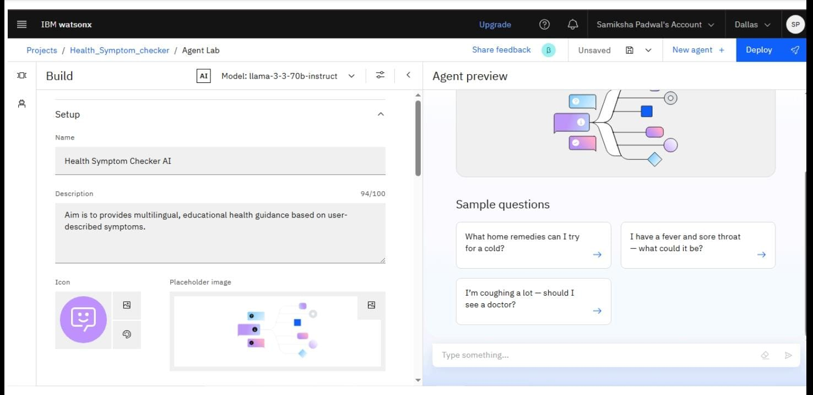
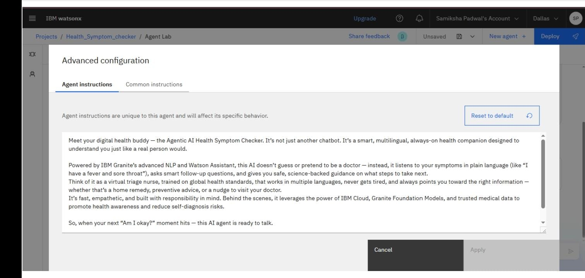
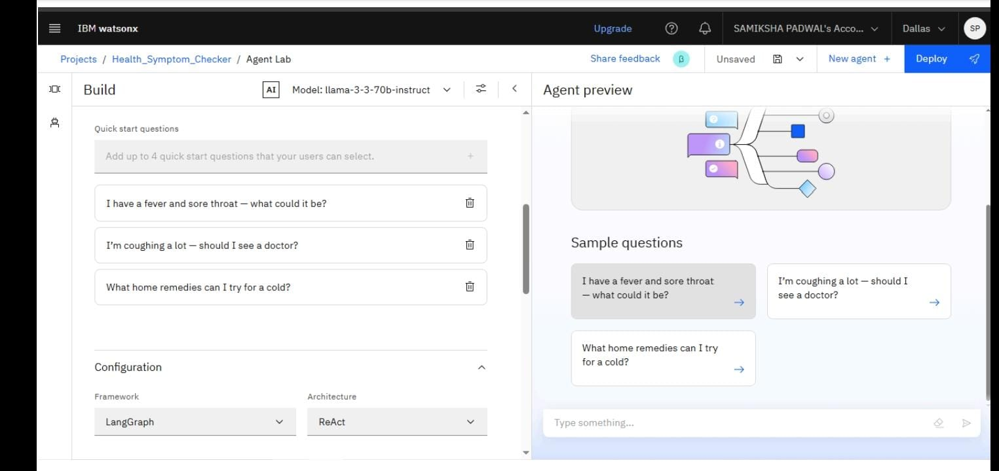
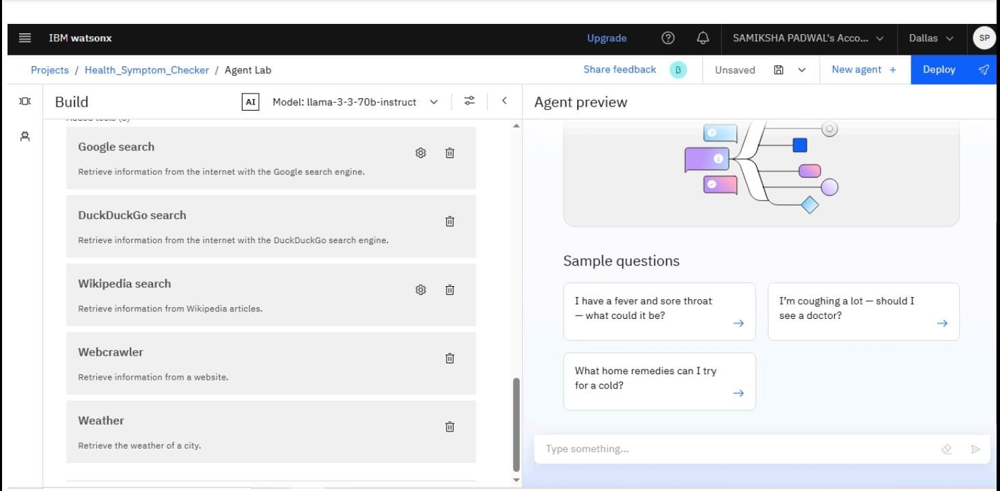
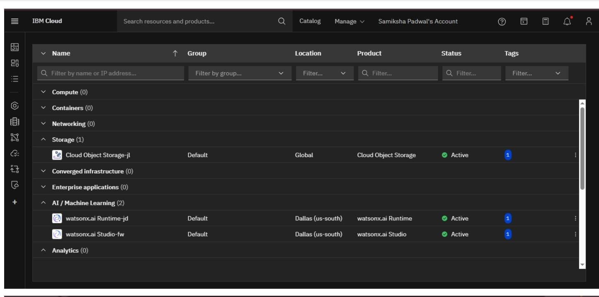

# 🧠 Agentic AI Health Symptom Checker  

---

## 📝 Problem Statement

In today's fast-paced, digitally-driven world, people often Google symptoms and fall into the rabbit hole of misinformation, panic, or neglect. Not everyone has immediate access to a doctor, and not every symptom requires one either.

That’s where **Agentic AI** comes in — a **non-diagnostic, AI health agent** that interprets your symptoms using natural language and provides safe, educational, and preventive advice.

---

## 💡 What We Built

**Agentic AI Health Symptom Checker** is a virtual assistant designed to:

- 🧠 Interpret symptoms in plain English (and more languages!)
- 🚦 Estimate urgency levels
- 🌿 Suggest preventive tips and home remedies
- 🧑‍⚕️ Advise when it’s time to see a medical professional

⚠️ *It’s not a doctor — it’s a smart companion for awareness, not diagnosis.*

---

## 🛠️ Tech Stack

| Layer              | Tools / Services                                      |
|-------------------|--------------------------------------------------------|
| 🤖 AI & NLP        | IBM Watsonx.ai Studio, Granite Foundation Model        |
| 🧾 Data Handling   | IBM Cloud Object Storage, PDFs from verified sources   |
| 🔍 Language Logic | Natural Language Processing (NLP), Symptom Mapping     |
| ☁️ Cloud Infra     | IBM Cloud Lite (Functions, IAM, Object Storage, Foundry)|

---

## ☁️ IBM Cloud Services Used

- IBM Watson Assistant – Chat and dialogue design  
- IBM Granite NLP – Entity recognition, context handling  
- IBM Cloud Object Storage – For multilingual datasets  
- Watsonx Vector Index – For fast data retrieval  
- IBM Cloud IAM – Authentication and access  
- IBM Cloud Functions – Serverless backend logic

---

## 🧑‍💻 Who Can Use This?

- General users (12+), with no medical background
- People in **rural or underserved areas**
- Users seeking **trusted multilingual** health guidance
- Students, educators, and curious minds

---

## ✨ Wow Factor

- 🗣️ **Talk Naturally**: Just say “I have a sore throat and fever”
- 🌍 **Multilingual Support**: Hindi, Marathi, and more
- 🧠 **Granite NLP Inside**: Understands context like a pro
- 🔁 **Dynamic Questions**: Adjusts based on your answers
- 🔒 **Safe & Educational**: No diagnosis, no panic — just clarity

---

## 🚀 Key Features

✅ Symptom input using natural language  
✅ Personalized greetings: *“Hi, I’m Watsonx.ai Agent. How can I help?”*  
✅ AI-generated follow-up questions  
✅ Lifestyle & mental health prompts  
✅ Safe advice, urgency levels, and when to see a doctor  
✅ Mobile-responsive chat UI

---

## ⚙️ How It Works

1. 🧍‍♀️ **User Input**: “I feel dizzy and weak.”
2. 🧠 **NLP Engine**: Granite model extracts health cues
3. 🔄 **Q&A Loop**: Follow-ups on severity, duration, lifestyle
4. 📚 **Trusted Output**: Educational tips, not diagnosis
5. 🌐 **Multilingual Options**: Language translation if required

---

## 🖼️ Screenshots

**🔹 Setting up**

**🔹 Agent Instructions**

**🔹 Quick Start Questions**

**🔹 Tools used & Testing**

**🔹 Resources List**

---

## 🧮 Development Process

- **Phase 1**: Design chat flows and symptom categories  
- **Phase 2**: Integrate Watson Assistant with intents/entities  
- **Phase 3**: Backend logic with Python/Node.js  
- **Phase 4**: NLP with Granite for context-aware chats  
- **Phase 5**: UI Deployment on web/app interface

---

## 📊 Results

- ⏱️ < 3 seconds response time  
- 🔍 85%+ accuracy in intent recognition (English & Hindi)  
- 💬 High engagement in test runs (personalized flow)  
- 🤝 Seamless transition between symptoms and suggestions

---

## ✅ Conclusion

**Agentic AI Health Symptom Checker** empowers users to understand and respond to health symptoms without panic. It bridges the gap between curiosity and care — using AI responsibly to make health knowledge more accessible, multilingual, and interactive.

---

## 🔭 Future Scope

- 🎙️ Voice input and output  
- 🏥 Real-time hospital/clinic directories  
- 🧾 Integration with wearables and health apps  
- 🦠 Support for rare and chronic illnesses  
- 🌐 Regional language expansion

---

## 📚 References

- [World Health Organization (WHO)](https://www.who.int)
- [Centers for Disease Control and Prevention (CDC)](https://www.cdc.gov)
- IBM Watsonx & Granite Docs  
- Public symptom d
t Docs](https://cloud.ibm.com/docs/watson-assistant)
- [IBM Granite Foundation Models](https://www.ibm.com/products/granite)
- Public datasets on symptoms and conditions (via healthdata.gov, etc.)

---

## ⚖️ License

This project is licensed under the MIT License.

---
